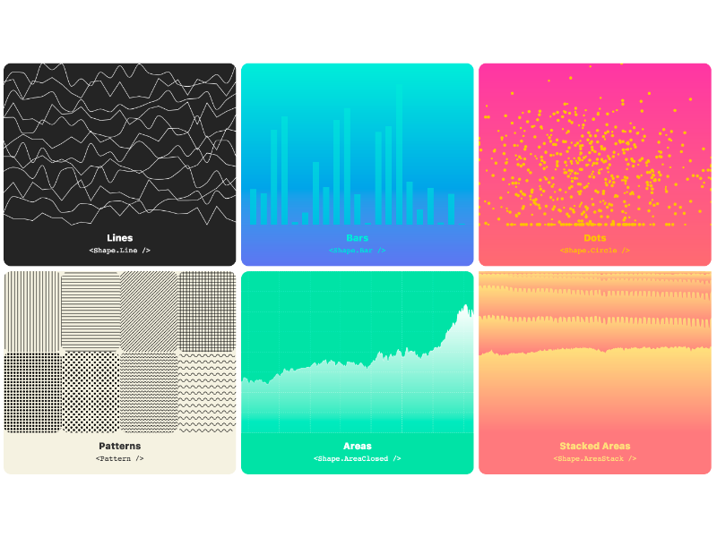

<p align="center">
  
</p>

<p align="center">
  <a title="npm version" href="https://www.npmjs.com/~visx">
    
  </a>
  <a title="@visx/shape npm downloads" href="https://www.npmjs.com/package/@visx/shape">
    
  </a>
  <a href="https://lerna.js.org/" alt="lerna">
     
  </a>
</p>

### visx

visx is a collection of reusable low-level visualization components. visx combines the power of d3
to generate your visualization with the benefits of react for updating the DOM.

<br />

<p align="center">
  <strong>
    <a href="https://airbnb.io/visx">Docs</a>
  </strong>
  &bull;
  <strong>
    <a href="https://airbnb.io/visx/gallery">Gallery</a>
  </strong>
  &bull;
  <strong>
    <a href="https://medium.com/vx-code/getting-started-with-vx-1756bb661410">Blog</a>
  </strong>
  &bull;
  <strong>
    <a href="https://github.com/airbnb/visx/discussions">Discussions</a>
  </strong>
  &bull;
  <strong>
    <a href="./CHANGELOG.md">Changelog</a>
  </strong>
  &bull;
  <strong>
    <a href="https://medium.com/vx-code/getting-started-with-vx-1756bb661410">Getting started tutorial</a>
  </strong>
</p>

<p align="center">
  <a href="https://airbnb.io/visx/gallery">
    
  </a>
</p>

## Usage

Let's make a simple bar graph.

First we'll install the relevant packages:

```bash
npm install --save @visx/mock-data @visx/group @visx/shape @visx/scale
```


```javascript
import React from 'react';
import { letterFrequency } from '@visx/mock-data';
import { Group } from '@visx/group';
import { Bar } from '@visx/shape';
import { scaleLinear, scaleBand } from '@visx/scale';

// We'll use some mock data from `@visx/mock-data` for this.
const data = letterFrequency;

// Define the graph dimensions and margins
const width = 500;
const height = 500;
const margin = { top: 20, bottom: 20, left: 20, right: 20 };

// Then we'll create some bounds
const xMax = width - margin.left - margin.right;
const yMax = height - margin.top - margin.bottom;

// We'll make some helpers to get at the data we want
const x = (d) => d.letter;
const y = (d) => +d.frequency * 100;

// And then scale the graph by our data
const xScale = scaleBand({
  range: [0, xMax],
  round: true,
  domain: data.map(x),
  padding: 0.4,
});
const yScale = scaleLinear({
  range: [yMax, 0],
  round: true,
  domain: [0, Math.max(...data.map(y))],
});

// Compose together the scale and accessor functions to get point functions
const compose = (scale, accessor) => (data) => scale(accessor(data));
const xPoint = compose(xScale, x);
const yPoint = compose(yScale, y);

// Finally we'll embed it all in an SVG
function BarGraph(props) {
  return (
    <svg width={width} height={height}>
      {data.map((d, i) => {
        const barHeight = yMax - yPoint(d);
        return (
          <Group key={`bar-${i}`}>
            <Bar
              x={xPoint(d)}
              y={yMax - barHeight}
              height={barHeight}
              width={xScale.bandwidth()}
              fill="#fc2e1c"
            />
          </Group>
        );
      })}
    </svg>
  );
}

// ... somewhere else, render it ...
// <BarGraph />
```

For more examples using `visx`, check out the [gallery](https://airbnb.io/visx/gallery).

## Motivation

**Goal**

The goal is to create a library of components you can use to make both your own reusable chart
library or your slick custom one-off chart. visx is largely unopinionated and is meant to be built
upon. Keep your bundle sizes down and use only the packages you need.

**How?**

Under the hood, visx is using d3 for the calculations and math. If you're creating your own awesome
chart library on top of visx, it's easy to create a component api that hides d3 entirely. Meaning
your team could create charts as easily as using reusable react components.

**But why?**

Mixing two mental models for updating the DOM is never a good time. Copy and pasting d3 code into
`componentDidMount()` is just that. This collection of components lets you easily build your own
reusable visualization charts or library without having to learn d3. No more selections or
`enter()`/`exit()`/`update()`.

## In the wild

- [williaster/data-ui](https://github.com/williaster/data-ui)
  ([Demo](https://williaster.github.io/data-ui/))
- [dylanmoz/trello](https://github.com/DylanMoz/dylanmoz.github.io/blob/source/src/pages/trello/TrelloGraph.js)
  ([Demo](http://dylanmoz.github.io/trello/))
  ([How to Make Beautiful Graphs With vx and React-Motion](https://devblog.classy.org/how-to-make-beautiful-graphs-with-vx-and-react-motion-6ffe7aecf6f3))
- [gkunthara/Crypto-Chart](https://github.com/gkunthara/Crypto-Chart)
  ([Tutorial](https://medium.com/@georgekunthara/after-the-tutorial-the-first-react-app-4dce6645634e))
- Collapsible tree with [`react-move`](https://github.com/react-tools/react-move) by
  [@techniq](https://github.com/techniq) ([Demo](https://codesandbox.io/s/n3w687vmqj))
  ([Radial demo](https://codesandbox.io/s/vmqwrkl395))
  ([More info](https://github.com/airbnb/visx/issues/162#issuecomment-335029517))
- Bitcoin 30-day price by [@hshoff](https://github.com/hshoff)
  ([Github](https://github.com/hshoff/viewsource#1-bitcoin-price-chart))
  ([YouTube](https://www.youtube.com/watch?v=oeE2tuspdHg))
- Ethereum candlestick chart by [@hshoff](https://github.com/hshoff)
  ([Github](https://github.com/hshoff/viewsource#2-ethereum-candlestick-chart))
- Song data visualization through spotify by [@bother7](https://github.com/bother7)
  ([Github](https://github.com/bother7/spotalyzer_frontend))
- Investment Calculator ([website](https://investmentcalculator.io/))
- Animation with [`react-spring`](https://github.com/drcmda/react-spring/) by
  [@drcmda](https://github.com/drcmda) ([Demo](https://codesandbox.io/embed/j3x61vjz5v))
- Code Coverage Dashboard by [@ezy](https://github.com/ezy)
  ([Github](https://github.com/ezy/code-coverage-dashboard))
- Ethereum Portfolio Toolkit by [@JayWelsh](https://github.com/JayWelsh)
  ([Demo](https://cryptocape.com/)) ([Github](https://github.com/JayWelsh/CryptoCape))
- Family tree by [@vkallore](https://github.com/vkallore)
  ([Github](https://github.com/vkallore/d3-vx-family-tree))
- South African Coronavirus Data Visuals by [@JayWelsh](https://github.com/JayWelsh)
  ([Demo](https://coronamap.co.za/)) ([Github](https://github.com/JayWelsh/coronamap))
- [CNN: Tracking America's Recovery](https://www.cnn.com/business/us-economic-recovery-coronavirus)
- [Wall Street Journal: Americans Familiarize Themselves with the Word ‘Forbearance’](https://blogs.wsj.com/dailyshot/2020/04/13/the-daily-shot-americans-familiarize-themselves-with-the-word-forbearance/)
  by [@rayshan](https://github.com/rayshan)
  ([Demo](https://finance.shan.io/recessions-bear-markets-compared))
- Dollar to food emoji caculator by [@gmlwo530](https://github.com/gmlwo530)
  ([Demo](https://dollar-to-food-emoji.web.app/))
  ([Github](https://github.com/gmlwo530/dollar-to-food-emoji))
- [zh-TW] Taiwan Real-time Air Quality Index by
  [@ArvinH](https://github.com/ArvinH)([Demo](https://codesandbox.io/s/simpleradar-aqi-with-tooltip-select-data-react-spring-item3?file=/Radar.tsx))([Tutorial](https://blog.arvinh.info/tech/datavis-visx))
- tokenized BTC on ethereum stacked chart with brush by [@sakulstra](https://github.com/sakulstra)
- [Escape From Tarkov Ammo Chart](https://eft.monster/) by
  [@codenomial](https://github.com/codenomial)
- [Pry](https://pry.co) Finance for Founders (dashboard by [@valtism](https://github.com/valtism))
- [Data 2 the People](https://www.data2thepeople.org/) Donation Efficacy Analysis for Downballot
  Races ([Demo](https://donate.data2thepeople.org/))
  ([Github](https://github.com/Data-2-the-People/skyfall/blob/master/components/Scatterplot.jsx))
- [Augora](https://augora.fr) Display information of french deputies
  ([Demo](https://augora.fr/statistiques))([Github](https://github.com/Augora/Augora))
- WHO Coronavirus (COVID-19) Dashboard is built on top of `vx`, earlier version of `visx`.
  ([Demo](https://covid19.who.int/))
- [Fig Stats](https://fig-stats.com) - Figma community plugin & widget analytics
- [Physician.FYI](https://physician.fyi) - Explore physicians' disciplinary history
- [Index by Superstardle](https://index.superstardle.com),
  [Salaries by Superstardle](https://salaries.superstardle.com), &
  [Pack'Em by Superstardle](https://playoffs.superstardle.com) - Explore professional sports teams
  and superstars in the world of underdogs, salaries, and playoff performances.
- Ridgeline chart visualizing shuffling probabilities by [@jmssnr](https://github.com/jmssnr)
  ([Demo](https://shuffling-probability.vercel.app/))
  ([Github](https://github.com/jmssnr/shuffling-probability))
- [UCSF Data Library](https://datalibrary.ucsf.edu) - Landing page for disease research tools
  ([Github](https://github.com/mountetna/monoetna/tree/master/vesta/ui))

Have a project that's using `visx`? Open a pull request and we'll add it to the list.

## FAQ

1. What does `visx` stand for?

   > visx stands for visualization components.

1. Do you plan on supporting animation/transitions?

   > A common criticism of visx is it doesn't have animation baked in, but this was a conscious
   > choice. It's a powerful feature to not bake it in.
   >
   > Imagine your app already bundles `react-motion`, adding a hypothetical `@visx/animation` is
   > bloat. Since visx is react, it already supports all react animation libs.
   >
   > Charting libraries are like style guides. Each org or app will eventually want full control
   > over their own implementation.
   >
   > visx makes this easier for everyone. No need to reinvent the wheel each time.
   >
   > more info: https://github.com/airbnb/visx/issues/6
   >
   > examples:
   >
   > - Collapsible tree with [`react-move`](https://github.com/react-tools/react-move) by
   >   [@techniq](https://github.com/techniq) ([Demo](https://codesandbox.io/s/n3w687vmqj))
   >   ([Radial demo](https://codesandbox.io/s/vmqwrkl395))
   > - Animation with `react-spring` by [@drcmda](https://github.com/drcmda)
   >   ([Demo](https://codesandbox.io/embed/j3x61vjz5v))

1. Do I have to use every package to make a chart?

   > nope! pick and choose the packages you need.

1. Can I use this to create my own library of charts for my team?

   > Please do.

1. Does visx work with [preact](https://preactjs.com/)?

   > yup! need to alias `react` + `react-dom` and use `preact-compat`.

1. I like using d3.

   > Me too.

## Development

Please see [CONTRIBUTING.md](./CONTRIBUTING.md)

:v:

[MIT](./LICENSE)
