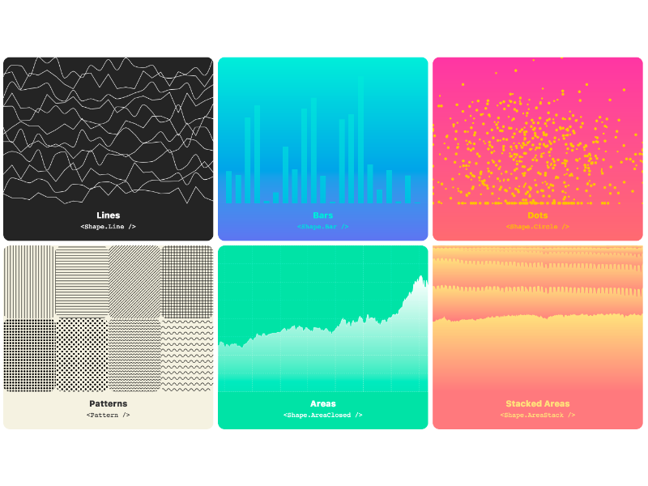
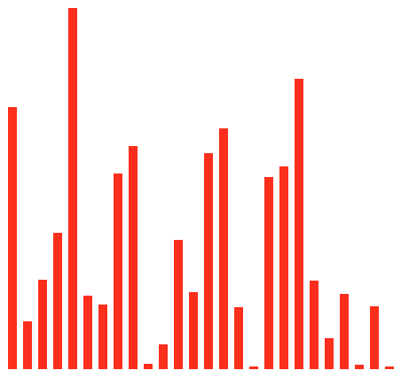

<p align="center">
  
</p>

<p align="center">
  <a title="npm version" href="https://www.npmjs.com/~visx">
    
  </a>
  <a title="@visx/shape npm downloads" href="https://www.npmjs.com/package/@visx/shape">
    
  </a>
</p>

### visx

visx is a collection of reusable low-level visualization components. visx combines the power of d3
to generate your visualization with the benefits of react for updating the DOM.

> [!IMPORTANT]
> **visx v4 is in alpha** with React 19 support. Install with the `@next` tag:
>
> ```bash
> npm install @visx/shape@next
> ```
>
> v3 remains the `latest` stable release. See the [migration guide](./MIGRATION.md) and [changelog](./CHANGELOG.md) for details.

<br />

<p align="center">
  <strong>
    <a href="https://airbnb.io/visx">Docs</a>
  </strong>
  &bull;
  <strong>
    <a href="https://airbnb.io/visx/gallery">Gallery</a>
  </strong>
  &bull;
  <strong>
    <a href="./CHANGELOG.md">Changelog</a>
  </strong>
  &bull;
  <strong>
    <a href="./MIGRATION.md">Migration</a>
  </strong>
</p>

<p align="center">
  <a href="https://airbnb.io/visx/gallery">
    
  </a>
</p>

## Usage

Let's make a simple bar graph.

First we'll install the relevant packages:

```bash
npm install --save @visx/mock-data @visx/group @visx/shape @visx/scale
```



```javascript
import React from 'react';
import { letterFrequency } from '@visx/mock-data';
import { Group } from '@visx/group';
import { Bar } from '@visx/shape';
import { scaleLinear, scaleBand } from '@visx/scale';

// We'll use some mock data from `@visx/mock-data` for this.
const data = letterFrequency;

// Define the graph dimensions and margins
const width = 500;
const height = 500;
const margin = { top: 20, bottom: 20, left: 20, right: 20 };

// Then we'll create some bounds
const xMax = width - margin.left - margin.right;
const yMax = height - margin.top - margin.bottom;

// Accessors
const getLetter = (d) => d.letter;
const getFrequency = (d) => d.frequency * 100;

// And then scale the graph by our data
const xScale = scaleBand({
  range: [0, xMax],
  round: true,
  domain: data.map(getLetter),
  padding: 0.4,
});
const yScale = scaleLinear({
  range: [yMax, 0],
  round: true,
  domain: [0, Math.max(...data.map(getFrequency))],
});

// Finally we'll embed it all in an SVG
function BarGraph() {
  return (
    <svg width={width} height={height}>
      {data.map((d) => {
        const letter = getLetter(d);
        const barHeight = yMax - (yScale(getFrequency(d)) ?? 0);
        return (
          <Group key={`bar-${letter}`}>
            <Bar
              x={xScale(letter)}
              y={yMax - barHeight}
              height={barHeight}
              width={xScale.bandwidth()}
              fill="#fc2e1c"
            />
          </Group>
        );
      })}
    </svg>
  );
}
```

For more examples using `visx`, check out the [gallery](https://airbnb.io/visx/gallery).

## Motivation

**Goal**

The goal is to create a library of components you can use to make both your own reusable chart
library or your slick custom one-off chart. visx is largely unopinionated and is meant to be built
upon. Keep your bundle sizes down and use only the packages you need.

**How?**

Under the hood, visx is using d3 for the calculations and math. If you're creating your own awesome
chart library on top of visx, it's easy to create a component api that hides d3 entirely. Meaning
your team could create charts as easily as using reusable react components.

**But why?**

Mixing two mental models for updating the DOM is never a good time. Copy and pasting d3 code into
`useEffect()` is just that. This collection of components lets you easily build your own reusable
visualization charts or library without having to learn d3. No more selections or
`enter()`/`exit()`/`update()`.

## FAQ

1. What does `visx` stand for?

   > visx stands for visualization components.

1. Do you plan on supporting animation/transitions?

   > A common criticism of visx is it doesn't have animation baked in, but this was a conscious
   > choice. It's a powerful feature to not bake it in.
   >
   > Imagine your app already bundles `react-motion`, adding a hypothetical `@visx/animation` is
   > bloat. Since visx is react, it already supports all react animation libs.
   >
   > Charting libraries are like style guides. Each org or app will eventually want full control
   > over their own implementation.
   >
   > visx makes this easier for everyone. No need to reinvent the wheel each time.
   >
   > more info: <https://github.com/airbnb/visx/issues/6>

1. Do I have to use every package to make a chart?

   > nope! pick and choose the packages you need.

1. Can I use this to create my own library of charts for my team?

   > Please do.

1. Does visx work with [preact](https://preactjs.com/)?

   > yup! need to alias `react` + `react-dom` and use `preact/compat`.

1. I like using d3.

   > Me too.

## Development

Please see [CONTRIBUTING.md](./CONTRIBUTING.md)

:v:

[MIT](./LICENSE)
